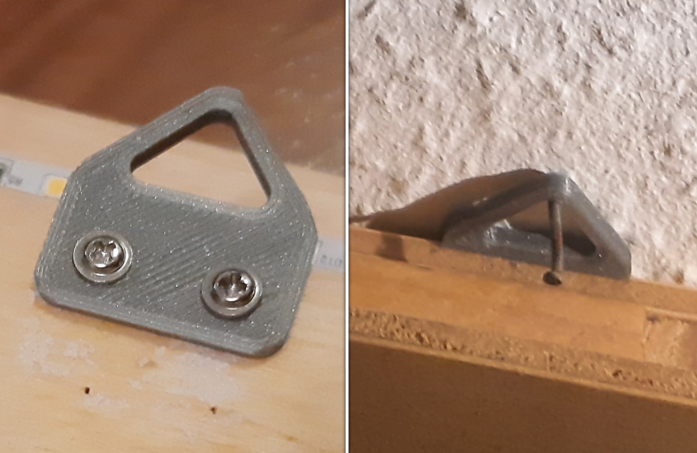

# Frame Hanger

A small project was the design of a frame hanger that can be screwed onto every frame. Commecially available solutions tend to be too fragile as they are designed for lightweight pictures. This 3D printed hanger is quite strong, although the strength depends on the material used.

_(The frame hanger screwed to a wooden box-lamp)_
